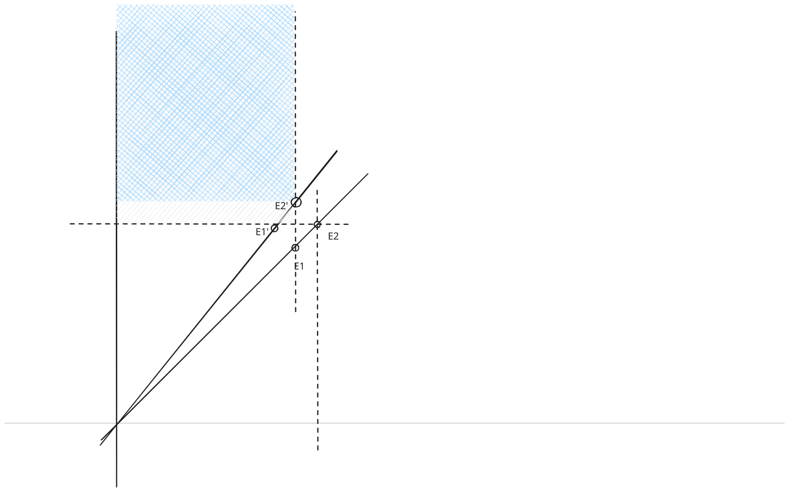

#TODO
# 非线性一致性协议

在这个例子里

Phase-1 中, 仍然是小于 least 的 Time 不允许 Commit,
Phase-1 读中, 我们读到的最大 History 分支, 变成了读一个 DAG History 的 maximum(fix this term).
Phase-2 append Event 时, 它依赖于所有 Time 小于它的 Event

现在我们可以证明这个算法允许同时 Commit 多个 Event 并行进行,
且也能满足正确性:

- Commit 后的值不会丢失, 总是能读到

# 选择二维向量 Time

那么我们可以选择任何偏序的 Time 类型作为系统的时间.
我们现在选择二维向量, 即 `Time: (x i + y j)`.
其中 i, j 是 2 个维度, x, y 表示 Time 在这两个维度上的值.
注意 x 和 y 可能是完全不同的类型,

## 二维之间的大小关系

`Time(xi+yj)` 中, 显然 `x₁ >= x₂ && y₁ >= y₂` 则 `T₁ >= T₂`,
但`x₁ > x₂ && y₁ < y₂`的情况, 在没有其他条件下是不能比较大小的.

然后我们还需要为Incompatible的MonoHistory之间定义一个Order, 但为了方便,我们完全可以假定所有MonoHistory之间有一个全序关系.

但是这个全序关系是什么样子的? 显然任何满足二维向量的偏序关系的Order都可以. 

### 条件: 不知道2个坐标系的数值
假设一个Proposer只在一条射线上, 每次增加d,进行下一次写;
但它不知道自己这条射线的斜率,或者说, 它只知道在射线上移动;
当它看到其他射线时,它只能对比另一个射线上的Event跟自己的相对位置来确定大小.

#TODO 
当E2发生时, 距离上一个E1
对于另一个临近的E2', 它在阴影区域内时不会产生冲突, 否则E2'的时间T大于E1的时间T, 导致E2'和E2 互相incompatible. 导致提交冲突.
所以最高效的情况是,对E2来说E2'在灰色+蓝色阴影区;
反之E2对E2'来说也是同理, E2最好在E2'的上一个Event E1'的下方.

所以结论是, 对E2来说, 不容易产生冲突的E2是位于蓝色阴影区

另外,

相邻2个射线上的点:
- 如果a和b发生在这2个位置, 那么就限制了u,v必须在线段uv 内会不和ab冲突.
- 同样b和v决定了下一个事件必须在bc之间.
所以两个射线上的事件间隔大小是交替的.
> 这时如果假设每条射线上的间隔差不多相等, 那么就可以得出v接近uw的中点, 那么就可以得出两条射线之间的**同时**点的关系: `y'=-k=-y/x` (这里的x,y是坐标)

实际上两射线有斜率差, 如果每条射线上的事件都是等距的,那么就可以满足不和另一个射线的前一个事件冲突. 但如果2条射线完全平行, 就会刚好每次都会冲突.

但是好像可以认为 `[x, y] [x',y]`中, 如果y一样, `x < x'` 不决定2个向量有小于的关系.
应该可以, 这样也满足了平行坐标轴的比较关系(光速) 可以不予考虑.

