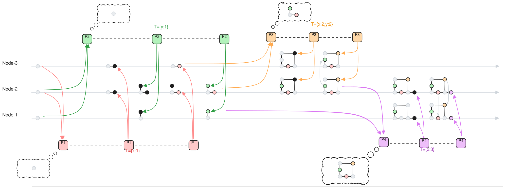

exmaple-crdt-define

上图中展示了一个并发更新和依赖更新的例子:

- 首先 P1 和 P2 并发的更新了 x 和 y: `set x=1` 和 `set y=2`, 他们使用的时间向量分别是`{x:1}` 和 `{y:1}`,因为没有公共分量所以互不影响.
  P1 和 P2 在 step-0 read 阶段都读到了空History;
  然后, P1 和 P2 并行的完成了 step-1 prepare, 在 node-2 上各自无冲突的完成;
  最后 P1 和 P2 又并行的完成了 step-2 write, 同样在 node-2 上无冲突完成各自的写入.

- 然后 P3 需要同时更新 x 和 y, `set x=x+y`, 所以它使用了 2 维的时间 `{x:2,y:2}`,表示它要同时和 x 分量和 y 分量定序, 且用于定序的值为2;
  P3 在 step-0 read 阶段, 从node-2 和node-3 上读到了不同的 History, 但是Compatible的,合并为 ; 
  P3 在 read 结果基础上新增 `{x:2,y:2}` 的时刻, 完成 phase-1 prepare; 这时, node-2上的`{y:1}`时刻有一个Event, node-3上`{y:1}`的时刻还只是prepare状态,没有Event;
  最后 P3 完成 phase-2 write.

- 然后 P4 只更新 x, 使用1维的时间 `{x:3}`, 表示它只需要和跟x有关的操作定序, 定序用的值为3, 因此它和 P3 有明确的先后顺序.
  P4 在 node-1 和 node-2 上完成 phase-0 read, 读到的History不同但Compatible, 合并为 ;
  然后 P4 在 node-1 和 node-2 上完成 phase-1 prepare, 注意 node-1 上的 `{x:1}` 和 `{x:2,y:2}` 上没有 Event, 只是prepare的状态.
  最后 P4 完成 phase-2 write 到 node-1 和 node-2.

这个虚拟时间的定义完整的描述了每个操作(Event) 之间的先后顺序, 所以我们只需把这个时间定义应用到我们的 Abstract Paxos 到这个系统, 就构建了一个满足这些顺序定义的分布式一致性协议, 而这个时间中允许不同 key 的并发的写入, 也就是说多个 key 的操作之间可以自由的互换顺序(commute), 于是我们就得到了一个 CRDT: **conflict-free replicated data type**的分布式存储系统.

另外我们也看到它比平时我们所提的 CRDT 更加完整和健壮: 它不仅定义了哪些操作可以互换顺序, 也定义了包含同样 key 的 2 个操作必须保证顺序, 在一个朴素的 CRDT 中, 它可能需要引入分布式事务来解决这个问题, 而在我们的 Abstract Paxos 中, 它已经原生的提供了这种能力.
